# La Cocina Del Diablo

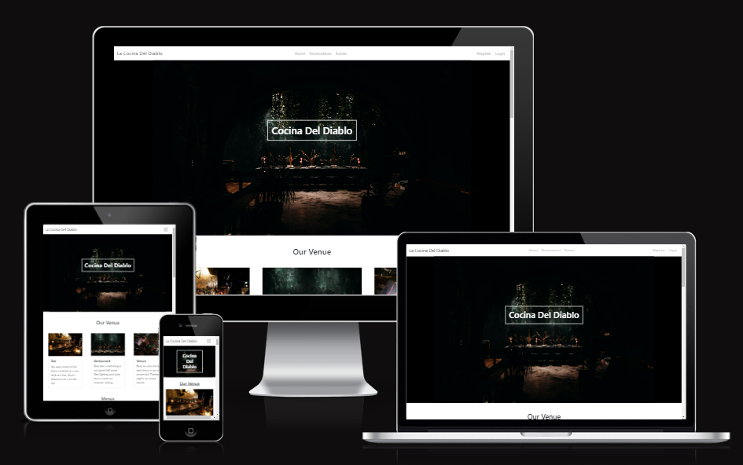

## A restaurant website.
> A themed restaurant website showcasing the venue, menu, events. The site also allows customers to created profiles and submit reservation requests to the restaurant.

### - By Alan Bushell

## **[Live site]()**

------------------------------------------------------------------

## **[Repository](https://github.com/Alan-Bushell/la-cocina-del-diablo)**
------------------------------------------------------------------
  
## Table of contents
<a name="contents">Back to Top</a>
 1. [ UX ](#ux)
 2. [Agile Development](#agile)
 3. [ Features ](#features)  
 4. [ Features Left to Implement ](#left)  
 5. [ Technology used ](#tech) 
 6. [ Testing ](#testing)  
 7. [ Bugs ](#bugs)  
 8. [ Deployment](#deployment)
 9. [ Credits](#credits)
 10. [ Content](#content)  
 11. [ Acknowledgements](#acknowledgements)  
 

[Back to Top of page](#contents)
## UX

#### Pre-project Planning

> Database Structure

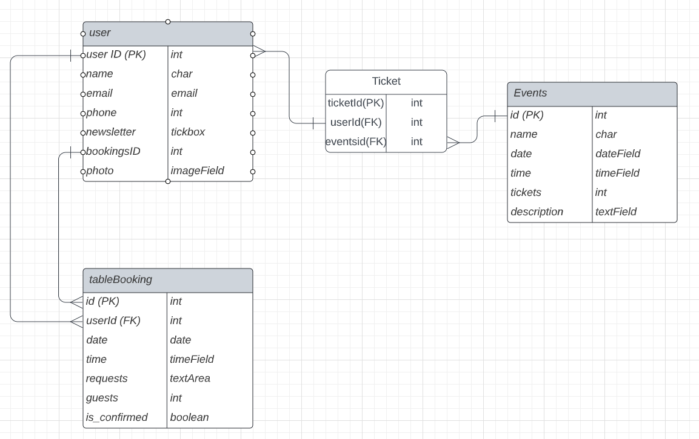

- When I decided on my initial concept of La concina del diablo I knew I needed to understand what type of data I would need to store and the relationships between them.
- I created the above diagram on lucidchart to help guide me.
- As of now when the project is finished the only model not implemented is the tickets model. 
- As explained below I have decided to ommit this feature until a further release / iteration.

# UX design

## Overview

La Cocina Del diablo is a Fictional restaurant I decided to come up with and design a website for.  
The main goal of the website is to allow users to view some photos of the venue, see what they have to offer, view the menu and if it is to their liking then the user can create an account and use it to make reservation requests.

### Design
Once the name was chosen I decided that I wanted this website to be modern, minimalistic in it's appearance to use base colors of Black and White where possible.
I only deviate from this where it helps user experience in regards to buttons, links or feedback from the booking feature.

### Site User

 - Someone within the same city as the restaurant looking for new places to visit
 - Someone looking to attend themed events and gigs
 - Someone who would prefer to make bookings digitally rather than speaking with others

###  Goals for the website

 - To allow customers to see their menus ahead of time
 - To allow customers to make bookings through the website and store them in a neat place for staff to accept / decline in an easy manner depending on occupancy
 - To showcase upcoming events to their customer base to ensure they have good attendance for the events.

## Wireframes

###  Wireframes

> index.html

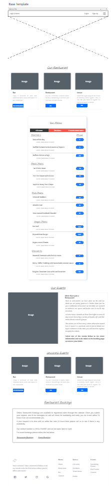

My goal for this project was to create a simple sleek website that allowed the restaurant to showcase it's venue & menu. I intentionally ensure the number of pages was at a minimum to ensure the core functionality was the focus.

> profile.html

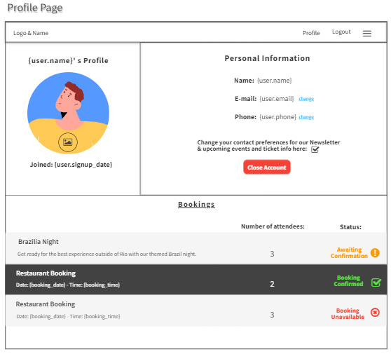

 The profile page was always going to be fundimental to the project being a success. I wanted to ensure that users had some control over their information and that it was presented in a nice clean way. By adding a split panel on top and a bookings panel on the bottom my goal was to seperate everything into easy to understand areas.

## Agile Development

### Agile Overview

This project was started alongside a GitHub Projects Page to track and manage the expected workload ahead.
The aim was to set out my expected workload, list the epics and then break them down into user stories or bite sized tasks to work towards and ultimately finish the site in good time.

To see Kanban please click [here](https://github.com/users/Alan-Bushell/projects/7).

At the initial stages I decided on 9 core requirements for the project and 3 Nice to haves but not important. (**NINTH**).

From these I added the user stories, acceptance criteria and the tasks so I can track my work effectively.

Once I completed a task I would tick the appropriate box and if all parts of this story were completed I would move it from **in progress** to **completed**.

At the end of a coding session I would update the user stories with a comment of:

 - What was done
 - What is left to be done
 - Reminders for myself to track where I finished so when I returned the following day I knew where I left off.

#### User stories

#####  Completed User Stories

To view any of the expanded details of the user stories please click on a user story below to be taken to the Kanban project.
If the specific user story does not auto pop up then please click on it from the project page and you will see the details and comments.

 1. [USER STORY: Deploy Website](https://github.com/Alan-Bushell/la-cocina-del-diablo/issues/1)
 2. [USER STORY: Admin Panel#2](https://github.com/Alan-Bushell/la-cocina-del-diablo/issues/2)
 3. [USER STORY: Create an account (CRUD)#3](https://github.com/Alan-Bushell/la-cocina-del-diablo/issues/3)
 4. [USER STORY: Base Template#4](https://github.com/Alan-Bushell/la-cocina-del-diablo/issues/4)
 5. [USER STORY: Make a Reservation#5](https://github.com/Alan-Bushell/la-cocina-del-diablo/issues/5)
 6. [USER STORY: Add or Edit Menu Items#7](https://github.com/Alan-Bushell/la-cocina-del-diablo/issues/7)
 7. [USER STORY: Edit Profile (CRUD)#8](https://github.com/Alan-Bushell/la-cocina-del-diablo/issues/8)
 8. [USER STORY: Delete Profile (CRUD)#9](https://github.com/Alan-Bushell/la-cocina-del-diablo/issues/9)
 9. [USER STORY: Testing#10](https://github.com/Alan-Bushell/la-cocina-del-diablo/issues/10)

The following User stories were not completed as they were deemed to be not necessary for this project at this time but are indications of possible future features:

 ##### NINTH User stories
 
 1. [USER STORY: Events#6](https://github.com/Alan-Bushell/la-cocina-del-diablo/issues/6)
 2. [USER STORY: Social Sharing#11](https://github.com/Alan-Bushell/la-cocina-del-diablo/issues/11)
 3. [USER STORY: Social Feed#12](https://github.com/Alan-Bushell/la-cocina-del-diablo/issues/12)

While USER STORY: Events#6 has some parts completed in terms of displaying upcoming events for the business, I decided against implementing a ticketing system at this time due to upcoming submission deadlines and because the core requirements of the project have been satisfied elsewhere.

[Back to Top of page](#contents)

---

## Features

#### User based Features Implemented:

 - **Users can** create an account (**Create**)
 - **Users can** log into their account
 - **Users can** log out of their account
 - **Users can** make a booking through the reservation form **(Create)**
 - **Users can** access their profile page & view their information and/or bookings **(Read)**
 - **Users can** add their name, contact number and e-mail to their profile (**Create**)
 - **Users can** view their bookings from their profile page (**Read**)
 - **Users can** edit their username or any other information they have on their profile (**Update**)
 - **Users can** add their image or update an image if it is already set on their profile(**Update**)
 - **Users can** edit their booking if it has not yet been accepted or declined (**Update**)
 - **Users can** delete bookings at any stage of the process from their profile page (**Delete**)
 - **Users can** delete their account from the profile page by clicking on delete account (**Delete**)

#### Account restrictions:
 - **Users cannot** access the profile section of an account without being logged in
 - **Users cannot** access the reservation form until they sign up or login
 - **Users cannot** edit a reservation once it has been accepted or declined
 - **Users cannot** edit their account number as this is their UserID and a primary key
 - **Users cannot** see other users bookings
 - **Users cannot** access the admin panel of the website unless they have admin status

#### Website features:

##### Dynamic Menu listings

 - The website displays dynamic menus that are updated on the back end and shown on the front-end depending on which menu the user selects.
 - If the menu is updated by the business owner then this change will reflect on the front end.
 - Additionally if the site owner wants to add extra items to the menus they will also display for customers.
 - This allows the business owner to make easy changes, change pricing, dishes, or even descriptions easily.

##### Events

 - The site has an events link that highlights upcoming events being held at the venue.
 - It shows users a list and if they select an event they are brought on to a page to show them the details of that event.
 - The site owner can make changes to existing events, or add new ones as they come up to display on the front end for users.

##### Booking System

 - Once a user has created an account they can make reservation requests with the business.
 - The site user only has to check the bookings field at the start of each day and decide if they have space to accommodate the bookings. 
 - If they have space they can accept the booking and this will display in the customer / users profile.
 - If they do not have space the site owner can decline the booking and the user / customer would be notified that the reservation has been declined.

### index.html

#### Desktop

> Desktop Navigation

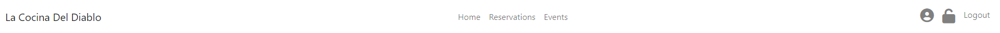

 - The desktop navigation consists of a Home, Reservations and Events link. 
 - If the user is logged in they have access to profiles through the profile icon.
 - If the user is a superuser they will then also have access to the django admin panel through the link beside logout. 

---

> Venue Cards

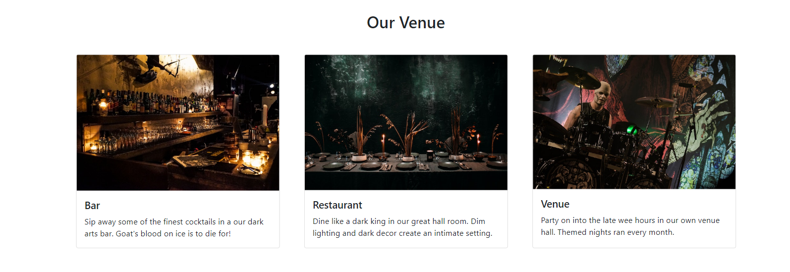

- The venu cards are just a quick was to display the different features of the Business. 
- They are a card deck that will be repeated below to convey structure of the site.
- The 3 cards are for Restaurant, Bar, Venue. Think of the devils pitchfork as a trident and that's what you have with this business.

---

> Menu collapsed

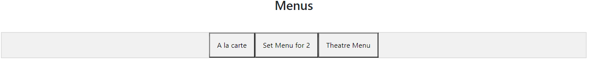

- The menu section consists of 3 menus. A la carte, Set menu and Theatre Menu.
- If a customer picks either Theatre or Set menu they will be shown only the selected menu.
- If the customer selects the A la carte menu they will see all menu items.

---

> Menu Expanded

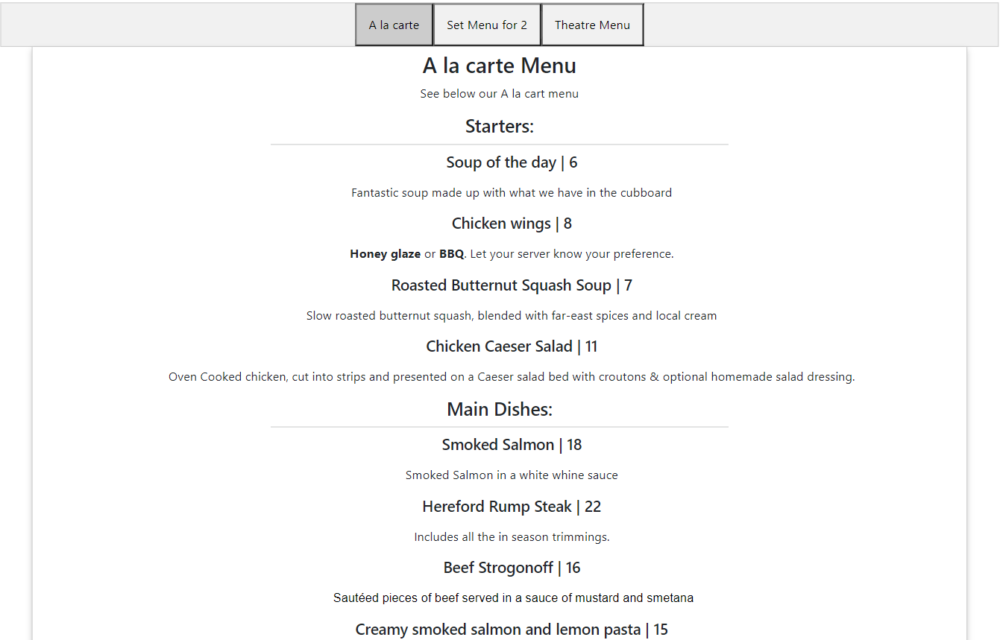

- The menu items are ordered by Starter, Main course, Dessert as you would expect to see on a restaurant menu
- The design was made to actually make it feel like the user was holding the menu in their hands.
- I set up the django templating so that if the business owner decides to add a dish to a menu then it will automatically display for them.
- They can delete or update pricing on the backend and it will update straight away on the front end.

---

> Upcoming Events

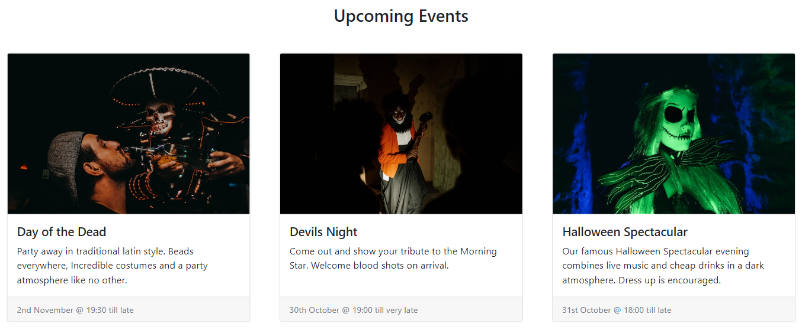

- Upcoming events is a way for the business to show themed nights / gigs or holiday events.
- In the future customers will be able to book tickets directly through the events page.
  
---

> Restaurant Booking Details

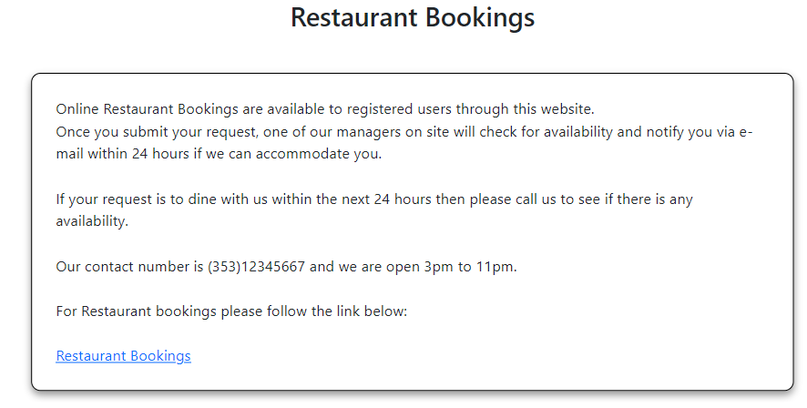

- I decided that I wanted to have almost a restaurant booking terms so that on the reservation page it is just the form.

---

> Footer

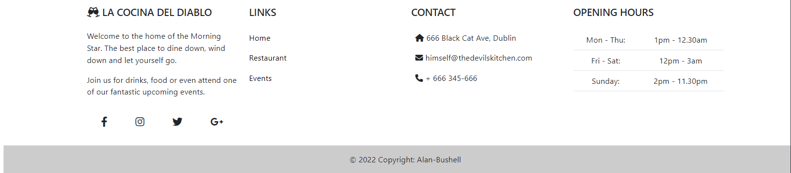

- The footer was designed to provide information and also functionality to the website.
- It includes base navigation but also provides contact information & opening times.

---

> Reservation form

- The reservation form contains the fields needed for a typical restaurant booking
- It is displayed over a nice paralax image.

---

> Mobile Navigation

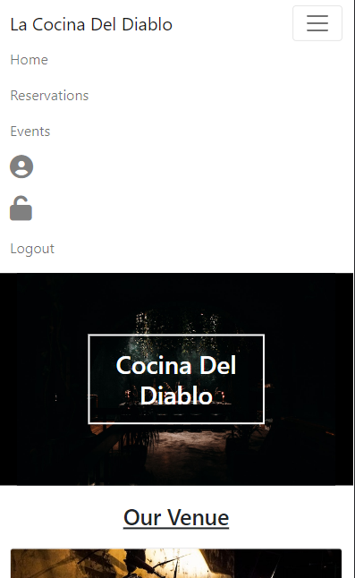

- I used bootstrap to ensure my site was rendered at the best quality possible on mobile devices.

---

> User profile

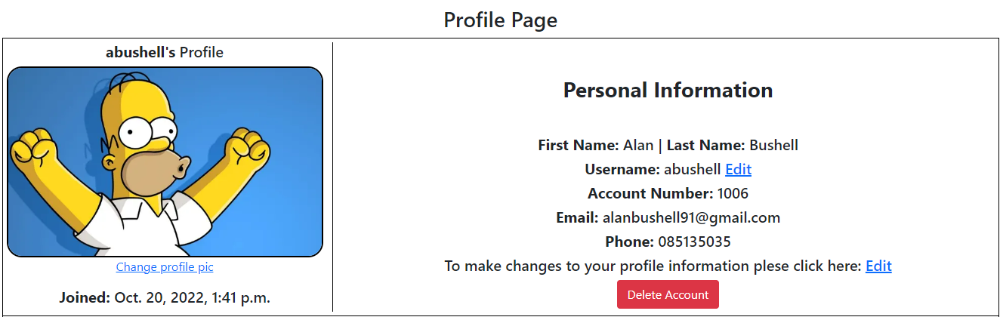

- The user profile section displays the image for the user along with the personal details.
- The user can amend all personal informayion except account number. This is actually the userID primary key. 
- I have added 100 to the userID and keep it as an account number if a user needed to query their account.

---

> User bookings section

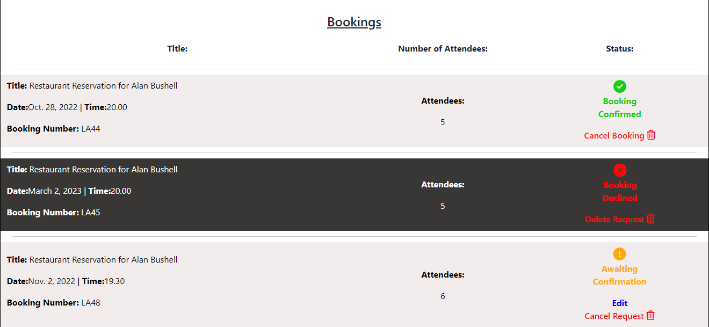

- The user booking section will show all bookings that have not been deleted.
- I incorporated a traffic light system for the status that changes depending on the outcome.
- When a customer submits a request the booking is in **awaiting confirmation** status.
- The business owner then views the bookings and information on the backend. 
- If they can accomodate the customer they move the status to confirmed, if they do not they move the booking to declined.
- This information is then relayed to the customer through the bookings in their profile.

---

> User profile on mobile

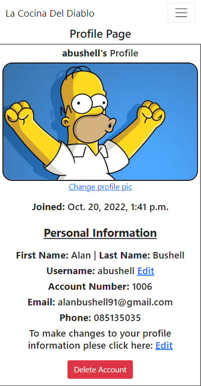

- User profile on mobile stacks in a column on mobile.

[Back to Top of page](#contents)

---

## Features left to Implement 

 - Add ability for customers to purchase / book tickets for events on their account get a copy by email and to the profile booking section of their account.
 - Add e-mail notification for any changes to bookings made through the site. For example when a booking request has gone from pending to approved the user gets an email notification to advise them of this change.
 - Allow users to comment on events or share on social directly.
 - Allow users to sign up with social media
 - Add a specials section to the menu for the business to highlight the current specials easily.
 - Originally I had the user image replace the profile icon on the navbar and would like to change that back in the next iteration. 
 - Add a contact form with auto e-mail responses from the site.
 - Incorporate a QR code generator for the events that once a ticket is issued a corresponding QR code is sent in an e-mail with the details of the booking. This would allow the business to scan the QR code to validate the ticket.
 - Add an online ordering platform for users to want to order takeaway. Menu with a shopping cart and payment checkout.
 - I originally planned to add a Boolean field for newsletter to the customer model but due to time constraints I decided against this at this time. In the future I would add this in to get consent from customers to build a mailing list for the business.

[Back to Top of page](#contents)

---

##  Technology Used

### Html

 - Used to structure my webpages and the base templating language

### CSS

 - Custom CSS was written on large chunks of this site to make it as close to the wireframes as I felt it needed to be.

### JavaScript

 -  Used to add timeout function for messages as well as to enable the menu on index.html

### Python

 -  Used for the logic in this project.

### Django

 -  Framework used to build this project. Provides a ready installed admin panel and includes many helper template tags that make writing code quick and efficient.

### Font Awesome

 -  Icon library used for the profile and admin panel section.

### Bootstrap 5
 - Used as the base front end framework to work alongside Django

### Jinja Templating with Django
 - Used to render logic within html documents and make the website more dynamic.

### GitHub
 - Used to store the code for this project & for the projects Kanban board used to complete it.

### Heroku
- Used to host and deploy this project

### Cloudinary
- Used to host the static files for this project including user profile images.

### Git
- Used for version control throughout the project and to ensure a good clean record of work done was maintained.

[Back to Top of page](#contents)

---

## Testing

### Testing Phase

#### Manual Testing

> Each user story was manually tested in line with intended functionality on both desktop & mobile.
> As this project was driven by my own User Stories I  felt manual testing was applicable on all logic code.

>If the intended outcome completes then this will be flagged as pass. If it does not then this is a fail.

#### Account Registration Tests
| Test |Result  |
|--|--|
| User can create account | Pass |
| User can log into account| Pass|
|User can log out of account|Pass|

---

#### User Navigation Tests

| Test |Result  |
|--|--|
|User can navigate to Reservations | Pass |
|User can access menu items| Pass|
|User access account profile page|Pass|
|User can access events items|Pass|
|SuperUser can access admin panel|Pass|

---

#### Account Security Tests

| Test |Result  |
|--|--|
|Non logged in user cannot make reservation | Pass |
|Non logged in user cannot access profile page| Pass|
|Non superuser cannot access admin panel|Pass|

---

#### Booking Tests

| Test |Result  |
|--|--|
|User can make a booking when all fields complete | Pass |
|User tries to submit booking with empty form |Fail|
|User tries to submit form without email address| Fail|
|User can view their made bookings from profile|Pass|
|User can edit booking while status is awaiting confirmation |Pass|
|User can cancel booking while status is awaiting confirmation|Pass|
|Edit button does not present on confirmed bookings|Pass|
|Edit button does not present on declined bookings |Pass|
|User can delete a pending booking|Pass|
|User can delete a confirmed booking|Pass|
|User can delete a declined booking|Pass|

--- 

#### Profile Tests

| Test |Result  |
|--|--|
|User can edit their user name from the profile page | Pass |
|User can edit / add a profile image from the profile page |Pass|
|User can edit / add a phone number to their account| Pass|
|User can edit their first and last name |Pass|
|User cannot edit their account number |Pass|
|User can add / edit their email address|Pass|
|User cannot change username to the same as another user|Pass|
|User cannot change their email to the same as another user |Pass|
|User presented with pop up modal when they click delete|Pass|
|User presented with correct start date on profile|Pass|
|User can delete a declined booking|Pass|
|User can delete account |Pass|

#### Admin Tests

| Test |Result  |
|--|--|
|Admin can add items to starters|Pass|
|Admin can add items to mains|Pass|
|Admin can add items to desserts|Pass|
|Admin can edit items in starters|Pass|
|Admin can edit items in mains|Pass|
|Admin can edit items in desserts|Pass|
|Admin can delete items in starters|Pass|
|Admin can delete items in mains|Pass|
|Admin can delete items in desserts|Pass|
|Items they display correctly on front-end when updated / added|Pass|

---

## Google Lighthouse Testing

### Desktop

> index.html

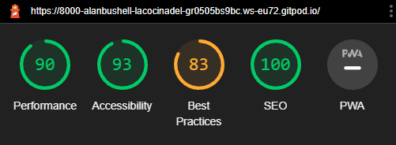

> profile.html

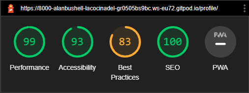

## HTML W3 Validation

### index.html

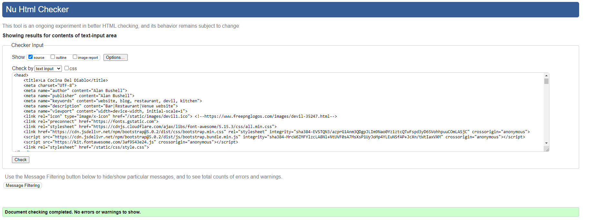
#### Result: No Errors

### CSS Validation

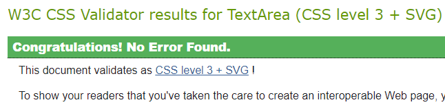
#### Result: Pass - No Errors

[Back to Top of page](#contents)

---

## **Bugs**

#### Django templating bug
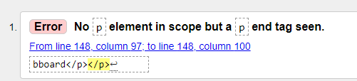

- When I ran my code through the w3 html validator I got over 40 errors that I did not expect.
- Upon review I could see Django was submitting fresh 
 Tags around my templated content for menu descriptions.
- I removed the existing 
 Tags from my HTML code and this issue was cleared.
  
#### Bookings not displaying
  
- When implementing the booking system to user profiles I linked the templates temporarily to the user-email.
- When a user tried to book under another email address that did not match the one on their account the bookings basically dissapeared.
- To fix this issue and also because I want users to be able to update their email I extended the user model with a customer model and linked each booking to userid.
- This way the customer will always have their own bookings.

[Back to Top of page](#contents)

---

## Deployment

> I have broken up the deployment into two sections as it is quite extensive and can be hard to follow.

To deploy the project through Heroku I followed these steps:

- Sign up / Log in to  [Heroku](https://www.heroku.com/)
- From the main Heroku Dashboard page select 'New' and then 'Create New App'
- Give the project a name - I decided on the devils kitchen and selected EU as that is the closes region to me.
- After this you select select create app. 
- The name for the app must be unique or you will not be able to continue.
- Heroku will create the app and bring you to the deploy tab. 
- From the submenu at the top, navigate to the resources tab.
- Add the database to the app, in the add-ons section search for 'Heroku Postgres', select the package that appears and add 'Heroku Postgres' as the database
- Click on the setting tab
- Open the config vars section copy the DATABASE_URL to the clipboard for use in the Django configuration.
- Inside the Django app repository create a new file called env.py
- within this file import the os library and set the environment variable for the DATABASE_URL pasting in the address copied from Heroku. 
- The line should appear as os.environ["DATABASE_URL"]= "Paste the link in here"
-   Add a secret key to the app using os.environ["SECRET_KEY"] = "your secret key goes here"
-   Add the secret key just created to the Heroku Config Vars as SECRET_KEY for the KEY value and the secret key value you created as the VALUE
-   In the settings.py file within the django app, import Path from pathlib, import os and import dj_database_url
-   insert the line if os.path.isfile("env.py"): import env
-   remove the insecure secret key that django has in the settings file by default and replace it with SECRET_KEY = os.environ.get('SECRET_KEY')
-   replace the databases section with DATABASES = { 'default': dj_database_url.parse(os.environ.get("DATABASE_URL"))} ensure the correct indentation for python is used.
-   In the terminal migrate the models over to the new database connection
---
-   Navigate in a browser to cloudinary, log in, or create an account and log in.
-   From the dashboard - copy the CLOUDINARY_URL to the clipboard
-   In the env.py file - add os.environ["CLOUDINARY_URL"] = "paste in the Url copied to the clipboard here"
-   In Heroku, add the CLOUDINARY_URL and value copied to the clipboard to the config vars
-   Also add the KEY - DISABLE_COLLECTSTATIC with the Value - 1 to the config vars
-   this key value pair must be removed prior to final deployment
-   Add the cloudinary libraries to the list of installed apps, the order they are inserted is important, 'cloudinary_storage' goes above 'django.contrib.staitcfiles' and 'cloudinary' goes below it.
-   in the Settings.py file - add the STATIC files settings - the url, storage path, directory path, root path, media url and default file storage path.
-   Link the file to the templates directory in Heroku TEMPLATES_DIR = os.path.join(BASE_DIR, 'templates')
-   Change the templates directory to TEMPLATES_DIR - 'DIRS': [TEMPLATES_DIR]
-   Add Heroku to the ALLOWED_HOSTS list the format will be the app name given in Heroku when creating the app followed by .herokuapp.com
-   In your code editor, create three new top level folders, media, static, templates
-   Create a new file on the top level directory - Procfile
-   Within the Procfile add the code - web: guincorn PROJECT_NAME.wsgi
-   In the terminal, add the changed files, commit and push to GitHub
-   In Heroku, navigate to the deployment tab and deploy the branch manually - watch the build logs for any errors.
-   Heroku will now build the app for you. Once it has completed the build process you will see a 'Your App Was Successfully Deployed' message and a link to the app to visit the live site.

#### Forking the repository

By forking the GitHub Repository you can make a copy of the original repository to view or change without it effecting the original repository.
You can do this by: 
-  Logging into GitHub or create an account. 
- Locate the repository at  [here](https://github.com/Alan-Bushell/la-cocina-del-diablo)  . 
-  At the top of the repository, on the right side of the page, select "Fork" from the buttons available. 
-  A copy of the repository should now be created in your own repository.

#### Create a clone of this repository

Creating a clone enables you to make a copy of the repository at that point in time - this lets you run a copy of the project locally: This can be done by:

-   Navigate to  [https://github.com/Alan-Bushell/la-cocina-del-diablo](https://github.com/Alan-Bushell/la-cocina-del-diablo)
-   click on the arrow on the green code button at the top of the list of files
-   select the clone by https option and copy the URL it provides to the clipboard
-   navigate to your code editor of choice and within the terminal change the directory to the location you want to clone the repository to.
-   type 'git clone' and paste the https link you copied from github
-   press enter and git will clone the repository to your local machine

[Back to Top of page](#contents)

---
  

## Credits
  
##### Dennis ivy
  - I watched some of Dennis's videos on youtube around django signals and extending the user model.
  - This inspired me to take this action however I followed on from the django documentation
  
  
##### Md bootstrap
  - I went through the bootstrap navigation information and footer information to determine how best to approach my desired design.
  - I always find Md Bootstrap helpful with examples of how best to implement boostrap components.

[Back to Top of page](#contents)

---

## Content & Resources
  
##### Django Documentation
  - Read through the django documentation multiple times when trying to implement models and other content.
  
##### W3 Schools
  - Used for reference throughout for simple css examples.
  
##### Code Institute
  - Course content for portfolio project 4 helped greatly in being able to complete this project.
  - I found the walkthroughs informative and well paced.

[Back to Top of page](#contents)

---

## Acknowledgements

### Dick Vlandeeren
> My mentor who provided me with constructive feedback  and guidance throughout.
  
### The tutors at Code institute
> To all the tutors in CI, thank you for your patience. Special shout outs to Ger, John, Sean & Oisin.
