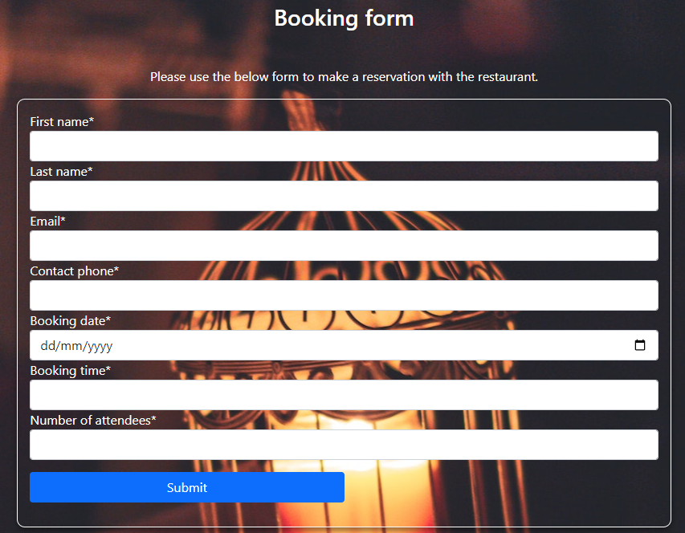

# La Cocina Del Diablo

## A restaurant website.
> A themed restaurant website showcasing the venue, menu, events. The site also allows customers to created profiles and submit reservation requests to the restaurant.

### - By Alan Bushell

## **[Live site]()**

------------------------------------------------------------------

## **[Repository](https://github.com/Alan-Bushell/la-cocina-del-diablo)**
------------------------------------------------------------------
  
## Table of contents

 1. [ UX ](#ux)
 2. [Agile Development](#agile)
 3. [ Features ](#features)  
 4. [ Features Left to Implement ](#left)  
 5. [ Technology used ](#tech) 
 6. [ Testing ](#testing)  
 7. [ Bugs ](#bugs)  
 8. [ Deployment](#deployment)
 9. [ Credits](#credits)
 10. [ Content](#content)  
 11. [ Acknowledgements](#acknowledgements)  

## UX

### Pre-project Planning

# UX design

## Overview

La Cocina Del diablo is a Fictional restaurant I decided to come up with and design a website for.  
The main goal of the website is to allow users to view some photos of the venue, see what they have to offer, view the menu and if it is to their liking then the user can create an account and use it to make reservation requests.

### Design
Once the name was chosen I decided that I wanted this website to be modern, minimalistic in it's appearance to use base colors of Black and White where possible.
I only deviate from this where it helps user experience in regards to buttons, links or feedback from the booking feature.

### Site User

 - Someone within the same city as the restaurant looking for new places to visit
 - Someone looking to attend themed events and gigs
 - Someone who would prefer to make bookings digitally rather than speaking with others

###  Goals for the website

 - To allow customers to see their menus ahead of time
 - To allow customers to make bookings through the website and store them in a neat place for staff to accept / decline in an easy manner depending on occupancy
 - To showcase upcoming events to their customer base to ensure they have good attendance for the events.

## Wireframes

###  Wireframes

> index.html

My goal for this project was to create a simple sleek website that allowed the restaurant to showcase it's venue & menu. I intentionally ensure the number of pages was at a minimum to ensure the core functionality was the focus.

> profile.html

 The profile page was always going to be fundimental to the project being a success. I wanted to ensure that users had some control over their information and that it was presented in a nice clean way. By adding a split panel on top and a bookings panel on the bottom my goal was to seperate everything into easy to understand areas.

## Agile Development

### Agile Overview

This project was started alongside a GitHub Projects Page to track and manage the expected workload ahead.
The aim was to set out my expected workload, list the epics and then break them down into user stories or bite sized tasks to work towards and ultimately finish the site in good time.

To see Kanban please click [here](https://github.com/users/Alan-Bushell/projects/7).

At the initial stages I decided on 9 core requirements for the project and 3 Nice to haves but not important. (**NINTH**).

From these I added the user stories, acceptance criteria and the tasks so I can track my work effectively.

Once I completed a task I would tick the appropriate box and if all parts of this story were completed I would move it from **in progress** to **completed**.

At the end of a coding session I would update the user stories with a comment of:

 - What was done
 - What is left to be done
 - Reminders for myself to track where I finished so when I returned the following day I knew where I left off.

#### User stories

#####  Completed User Stories

To view any of the expanded details of the user stories please click on a user story below to be taken to the Kanban project.
If the specific user story does not auto pop up then please click on it from the project page and you will see the details and comments.

 1. [USER STORY: Deploy Website](https://github.com/Alan-Bushell/la-cocina-del-diablo/issues/1)
 2. [USER STORY: Admin Panel#2](https://github.com/Alan-Bushell/la-cocina-del-diablo/issues/2)
 3. [USER STORY: Create an account (CRUD)#3](https://github.com/Alan-Bushell/la-cocina-del-diablo/issues/3)
 4. [USER STORY: Base Template#4](https://github.com/Alan-Bushell/la-cocina-del-diablo/issues/4)
 5. [USER STORY: Make a Reservation#5](https://github.com/Alan-Bushell/la-cocina-del-diablo/issues/5)
 6. [USER STORY: Add or Edit Menu Items#7](https://github.com/Alan-Bushell/la-cocina-del-diablo/issues/7)
 7. [USER STORY: Edit Profile (CRUD)#8](https://github.com/Alan-Bushell/la-cocina-del-diablo/issues/8)
 8. [USER STORY: Delete Profile (CRUD)#9](https://github.com/Alan-Bushell/la-cocina-del-diablo/issues/9)
 9. [USER STORY: Testing#10](https://github.com/Alan-Bushell/la-cocina-del-diablo/issues/10)

The following User stories were not completed as they were deemed to be not necessary for this project at this time but are indications of possible future features:

 ##### NINTH User stories
 
 1. [USER STORY: Events#6](https://github.com/Alan-Bushell/la-cocina-del-diablo/issues/6)
 2. [USER STORY: Social Sharing#11](https://github.com/Alan-Bushell/la-cocina-del-diablo/issues/11)
 3. [USER STORY: Social Feed#12](https://github.com/Alan-Bushell/la-cocina-del-diablo/issues/12)

While USER STORY: Events#6 has some parts completed in terms of displaying upcoming events for the business, I decided against implementing a ticketing system at this time due to upcoming submission deadlines and because the core requirements of the project have been satisfied elsewhere.

## Features

#### User based Features Implemented:

 - **Users can** create an account (**Create**)
 - **Users can** log into their account
 - **Users can** log out of their account
 - **Users can** make a booking through the reservation form **(Create)**
 - **Users can** access their profile page & view their information and/or bookings **(Read)**
 - **Users can** add their name, contact number and e-mail to their profile (**Create**)
 - **Users can** view their bookings from their profile page (**Read**)
 - **Users can** edit their username or any other information they have on their profile (**Update**)
 - **Users can** add their image or update an image if it is already set on their profile(**Update**)
 - **Users can** edit their booking if it has not yet been accepted or declined (**Update**)
 - **Users can** delete bookings at any stage of the process from their profile page (**Delete**)
 - **Users can** delete their account from the profile page by clicking on delete account (**Delete**)

#### Account restrictions:
 - **Users cannot** access the profile section of an account without being logged in
 - **Users cannot** access the reservation form until they sign up or login
 - **Users cannot** edit a reservation once it has been accepted or declined
 - **Users cannot** edit their account number as this is their UserID and a primary key
 - **Users cannot** see other users bookings
 - **Users cannot** access the admin panel of the website unless they have admin status

#### Website features:

##### Dynamic Menu listings

 - The website displays dynamic menus that are updated on the back end and shown on the front-end depending on which menu the user selects.
 - If the menu is updated by the business owner then this change will reflect on the front end.
 - Additionally if the site owner wants to add extra items to the menus they will also display for customers.
 - This allows the business owner to make easy changes, change pricing, dishes, or even descriptions easily.

##### Events

 - The site has an events link that highlights upcoming events being held at the venue.
 - It shows users a list and if they select an event they are brought on to a page to show them the details of that event.
 - The site owner can make changes to existing events, or add new ones as they come up to display on the front end for users.

##### Booking System

 - Once a user has created an account they can make reservation requests with the business.
 - The site user only has to check the bookings field at the start of each day and decide if they have space to accommodate the bookings. 
 - If they have space they can accept the booking and this will display in the customer / users profile.
 - If they do not have space the site owner can decline the booking and the user / customer would be notified that the reservation has been declined.

### index.html

#### Desktop

> Desktop Navigation

 - The desktop navigation consists of a Home, Reservations and Events link. 
 - If the user is logged in they have access to profiles through the profile icon.
 - If the user is a superuser they will then also have access to the django admin panel through the link beside logout. 

---

> Venue Cards

- The venu cards are just a quick was to display the different features of the Business. 
- They are a card deck that will be repeated below to convey structure of the site.
- The 3 cards are for Restaurant, Bar, Venue. Think of the devils pitchfork as a trident and that's what you have with this business.

---

> Menu collapsed

- The menu section consists of 3 menus. A la carte, Set menu and Theatre Menu.
- If a customer picks either Theatre or Set menu they will be shown only the selected menu.
- If the customer selects the A la carte menu they will see all menu items.

---

> Menu Expanded

- The menu items are ordered by Starter, Main course, Dessert as you would expect to see on a restaurant menu
- The design was made to actually make it feel like the user was holding the menu in their hands.
- I set up the django templating so that if the business owner decides to add a dish to a menu then it will automatically display for them.
- They can delete or update pricing on the backend and it will update straight away on the front end.

---

> Upcoming Events

- Upcoming events is a way for the business to show themed nights / gigs or holiday events.
- In the future customers will be able to book tickets directly through the events page.
  
---

> Restaurant Booking Details

---

> Footer

---

> Reservation form

---

> Mobile Navigation

#### Profile

> User profile

> User bookings section

> User profile on mobile

## Features left to Implement 

 - Add ability for customers to purchase / book tickets for events on their account get a copy by email and to the profile booking section of their account.
 - Add e-mail notification for any changes to bookings made through the site. For example when a booking request has gone from pending to approved the user gets an email notification to advise them of this change.
 - Allow users to comment on events or share on social directly.
 - Allow users to sign up with social media
 - Add a specials section to the menu for the business to highlight the current specials easily.
 - Originally I had the user image replace the profile icon on the navbar and would like to change that back in the next iteration. 
 - Add a contact form with auto e-mail responses from the site.
 - Incorporate a QR code generator for the events that once a ticket is issued a corresponding QR code is sent in an e-mail with the details of the booking. This would allow the business to scan the QR code to validate the ticket.
 - Add an online ordering platform for users to want to order takeaway. Menu with a shopping cart and payment checkout.
 - I originally planned to add a Boolean field for newsletter to the customer model but due to time constraints I decided against this at this time. In the future I would add this in to get consent from customers to build a mailing list for the business.

##  Technology Used

### Html

 - Used to structure my webpages and the base templating language

### CSS

 - Custom CSS was written on large chunks of this site to make it as close to the wireframes as I felt it needed to be.

### JavaScript

 -  Used to add timeout function for messages as well as to enable the menu on index.html

### Python

 -  Used for the logic in this project.

### Django

 -  Framework used to build this project. Provides a ready installed admin panel and includes many helper template tags that make writing code quick and efficient.

### Font Awesome

 -  Icon library used for the profile and admin panel section.

### Bootstrap 5
 - Used as the base front end framework to work alongside Django

### Jinja Templating with Django
 - Used to render logic within html documents and make the website more dynamic.

### GitHub
 - Used to store the code for this project & for the projects Kanban board used to complete it.

### Heroku
- Used to host and deploy this project

### Cloudinary
- Used to host the static files for this project including user profile images.

### Git
- Used for version control throughout the project and to ensure a good clean record of work done was maintained.

# Testing

### Testing Phase

#### Manual Testing

| Test | Result |
|--|--|
|Sample test| Pass |

### User testing

#### User tests

## Google Lighthouse Testing

### Desktop

> index.html

> profile.html

## HTML W3 Validation

### index.html

#### Result: Errors

### CSS Validation

#### Result: Pass - No Errors

## **Bugs**

## Deployment

## Credits

## Content & Resources

### Code Institute
> Project created in line with course content and within portfolio project 4 scope.

## Acknowledgements

### Dick Vlandeeren
> My mentor who provided me with constructive feedback  and guidance throughout.
